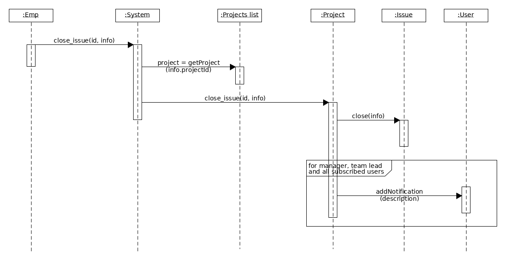

# Method-based sequence diagrams

- [create report](#create-report)
- [add issue](#add-issue)
- [add issue](#add-to-archive)
- [close issue](#close-issue)

## Create report

[UXF file](method_sequences/create_report.uxf)

[Precedent](method_sequences.md#create-report)

## Add issue

[UXF file](method_sequences/add_issue.uxf)

[Precedent](method_sequences.md#add-issue)

## Add to archive

[UXF file](method_sequences/add_to_archive.uxf)

[Precedent](method_sequences.md#add-to-archive)

## Close issue

[UXF file](method_sequences/close_issue.uxf)

[Precedent](method_sequences.md#close-issue)
