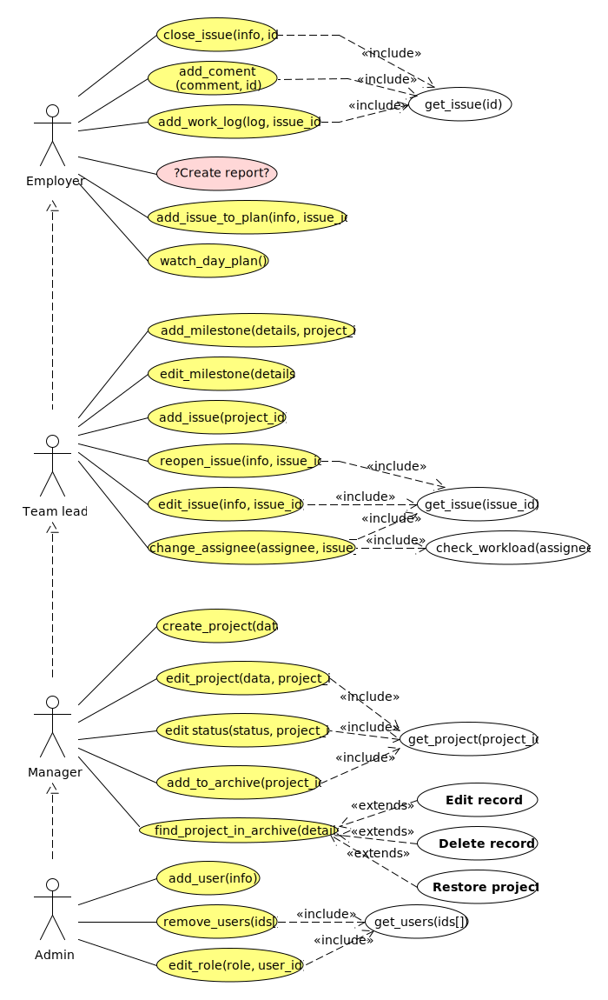

# Прецеденты
- [x] [close issue](#close-issue)
- [x] [add comment](#add-comment)
- [x] [add work log](#add-work-log)
- [x] [create report](#create-report)
- [x] [plan day](#plan-day)
- [x] [watch day plan](#watch-day-plan)
- [x] [add milestone](#add-milestone)
- [ ] [edit milestone](#edit-milestone)
- [X] [add issue](#add-issue)
- [ ] [reopen issue](#reopen-issue)
- [ ] [edit issue details](#edit-issue-details)
- [ ] [change assignee](#change-assignee)
- [ ] [create project](#create-project)
- [ ] [edit project](#edit-project)
- [ ] [edit status](#edit-status)
- [X] [add to archive](#add-to-archive)
- [ ] [find project in archive](#find-project-in-archive)
- [ ] [add user](#add-user)
- [ ] [remove user](#remove-user)
- [ ] [edit role](#edit-role)

## Диаграмма

## Шаблон
### Название

1. Краткая характеристика, назначение:

    Характеристика.
2. Предусловие:

    Условие.
3. Типичный поток событий:

    | Действие пользователя | Отклик системы |
    |-----------------------|----------------|
    |  a | b  |

4. Альтернативные потоки событий:

    | Действие пользователя | Отклик системы |
    |-----------------------|----------------|
    |  a | b  |

5. Постусловие:
    
    Условие.

## Контент
### Close Issue

1. Краткая характеристика, назначение:

    Когда Employee считает, что работа завершена, то он закрывает issue.
    Issue переводится на team lead'а. Пользователь может изменить 
    значения некоторых полей при закрытии issue 
    (например, он может указать номер версии, начиная 
    с которой изменения добавлены в программу).
2. Предусловие:

    Пользователь авторизован. Открыто главное меню и отображается
    список с краткой информацией о Issues, из тех проектов, 
    к которым у него есть доступ. Пользователь может фильтровать 
    этот список для поиска Issue по любому из полей.

3. Типичный поток событий:

    | Действие пользователя | Отклик системы |
    |-----------------------|----------------|
    | Пользователь выбирает Issue | System получает Issue из Project, System выводит подробную информацию о Issue |
    | Пользователь нажимает кнопку «Close Issue» | System формирует диалоговое окно, в котором пользователь может ввести дополнительную информацию |
    | Пользователь заполняет необходимые поля (resolve status, комментарий) и нажимает кнопку «Close» | Диалоговое окно закрывается. System вызывает метод `close_issue(id, info)` у Project. Project вызывает метод `close(info)` у Issue, и рассылает уведомления всем подписанным на эту Issue Employee |

4. Альтернативные потоки событий:

    | Действие пользователя | Отклик системы |
    |-----------------------|----------------|
    | Пользователь выбрал Issue над которым работает не он | Кнопка «Close issue» является неактивной |
    | Пользователь заполнил одно из полей некорректно | Выводится сообщение о неправильно заполненных полях |

5. Постусловие:

    Внесены изменения полей Issue. Team lead'у и другим подписанным Employee добавлено уведомление 'Issue {issue title} is closed.'.

### Add comment

1. Краткая характеристика, назначение:

    Если сотрудник хочет оставить примечание, 
    или обсудить задачу, он может оставить комментарий, 
    сославшись на другого работника.
2. Предусловие:

    Пользователь авторизован и имеет доступ к какому-либо issue.
    Это может быть как главный экран проекта, где перечислены все открытые issue,
    так и любой другой, откуда можно issue открыть.
3. Типичный поток событий:

    | Действие пользователя | Отклик системы |
    |-----------------------|----------------|
    | Выбирает Issue | System сохраняет выбранный id. System получает issue по id у выбранного Project'а. System дает пользователю подробную информацию |
    | Пользователь вводит текст комментария и нажимает кнопку Add comment | Диалоговое окно закрывается. System вызывает метод add_comment(comment, issue) у Project. Project вызывает метод add_comment(comment) у Issue, и рассылает уведомления всем подписанным на эту Issue Employee и тем, на кого есть ссылки в комментарии. Issue добавляет Comment в список комментариев. |

4. Альтернативные потоки событий:

    | Действие пользователя | Отклик системы |
    |-----------------------|----------------|

5. Постусловие:

    К Issue добавлен Comment. Каждому User'у
    на которого есть ссылка в комментарии, добавлено уведомление.

### Add work log

1. Краткая характеристика, назначение:

    Для отслеживания прогресса по Issue, оценке оставшегося времени
    и отслеживания отработаных часов работниками, сотрудники могут 
    заполнять маленькие отчеты по каждой задаче.
2. Предусловие:

    Сотрудник авторизирован и закреплен за какой-то из Issue.
3. Типичный поток событий:

    | Действие пользователя | Отклик системы |
    |-----------------------|----------------|
    | Пользователь выбрал Issue | System получил project из Projects_list. System получило по id Issue из project. System выводит подробную информацию о Issue. |
    | Пользователь нажимает кнопку «Add work log» | System формирует и выводит форму для заполнения. |
    | Пользователь заполняет поля "комментарий", "затраченое время", "оставшееся время", нажимает кнопку «Submit» | System вызывает метод `add_work_log(info)` у Issue, Issue создает объект Work log и добавляет его во внутренюю коллекцию. |

4. Альтернативные потоки событий:

    | Действие пользователя | Отклик системы |
    |-----------------------|----------------|
    | Пользователь не является исполнителем этого Issue | Кнопка «Add work log» не активна. |

5. Постусловие:

    Запись Work log добавлена к Issue.

### Create report

1. Краткая характеристика, назначение:

    Чтобы отслеживать какие-либо показатели по проектам,
    сотрудники могут создать отчет.
    Особенно полезно для рядового сотрудника отслеживать
    количество отработанных часов за месяц по всем или только некоторым проектам.
    Таким же образом менеджеры могут следить за выполнением месячных или каких-то других планов,
    наблюдать за тенденциями.
2. Предусловие:

    Пользователь авторизирован и является членом хотя бы одного проекта.
3. Типичный поток событий:

    | Действие пользователя | Отклик системы |
    |-----------------------|----------------|
    | Пользователь выбирает тип Report | System запоминает выбор и выводит форму |
    | Пользователь заполняет форму и нажимает <<Create>> | System собирает нужную информацию из проектов, выводит ее пользователю |

    Для Timesheet report:

    | Действие пользователя | Отклик системы |
    |-----------------------|----------------|
    | Пользователь заполняет начальную и конечную даты, выбирает проекты, 
    выбирает пользователя (используется данный, если не указано), отмечает, нужно ли показывать выходные в таблице | System запрашивает Project у Project List по данным id, у каждого Project запрашивает все Issue, которые выполнялись/выполняются пользователем в данный промежуток времени, запрашиваются часы по дням для каждого из Issue |
    |   | Work Log для одного Issue в течении дня суммируются, формируя таблицу, где строки &mdash; Issue, столбцы &mdash; дни, а клетки &mdash; часы работы. |
    |   | Данная таблица выводится пользователю. |

4. Альтернативные потоки событий:

    | Действие пользователя | Отклик системы |
    |-----------------------|----------------|
    | Пользователь не состоит в проектах которые он указал | Кнопка <Create report> не активна, выводится предупреждение о некорректном поле формы |

    Отчет создан:

    | Действие пользователя | Отклик системы |
    |-----------------------|----------------|
    | Пользователь нажимает на кнопку <<Export>> | System выводит интерактивную форму с поддерживаемыми форматами для экспорта и путь сохранения файла |
    | Пользователь вводит данные и нажимает на кнопку <<Confirm>> | System экспортирует отчет в указнный формат и сохраняет результирующий файл по выбранному пути |

5. Постусловие:

    Отчет создан [и экспортирован во внешний файл].

### Plan Day

1. Краткая характеристика, назначение:

    Составление и изменение списка задач определённым пользователем на день.
    План на день включает список задач, примерное время и комментарии 
    (заметки), которые пользователь может оставить для себя.
    Также пользователь может расставлять приоритеты.
2. Предусловие:

    Пользователь авторизован как минимум как Employee, 
    справа находится меню, в котором отображается его текущий план.
3. Типичный поток событий:

    | Действие пользователя | Отклик системы |
    |-----------------------|----------------|
    | пользователь выбирает issue и нажимает кнопку «Add to today's list» для выбранного issue | System получил project из Projects_list. System получило по id Issue из project. System выводит диалоговое окно, в котором пользователь может ввести данные (приоритет, комментарий и ожидаемое время выполнения). |
    | Пользователь вводит данные и нажимает кнопку «OK» | System получил user из Users_list. Система вызывает метод AddTask у User. User проверяет правильность введённых данных. User передаёт task_datails в TaskList, который создаёт Task и добавляет его в контейнер. |
    | Пользователь нажимает кнопку «Edit» в меню справа для добавленного issue | System получает Task у user'a. System выводит диалоговое окно, где пользователь может изменить данные. |
    | Пользователь вводит данные и нажимает кнопку «OK» | System получил user из Users_list. Система вызывает метод EditTask у User. User проверяет правильность введённых данных. User передаёт task_datails в TaskList, который обновляет Task |

4. Альтернативные потоки событий:

    | Действие пользователя | Отклик системы |
    |-----------------------|----------------|

5. Постусловие:

    У пользователя изменён DayTaskList.
    При необходимости ему добавено Notification.

### Watch day plan

1. Краткая характеристика, назначение:

    Чтобы эффективно спланировать выполнение разнообразных issue
    вместе с заданиями которые могут быть вне системы,
    сотруднику может понадобиться данный список.
2. Предусловие:

    Сотрудник авторизирован и закреплен за какими-то активными issue.
3. Типичный поток событий:

    | Действие пользователя | Отклик системы |
    |-----------------------|----------------|
    | Пользователь нажимает на кнопку watch day plan | У `System` вызывается метод `show_day_plan`. `System` получает текущего пользователя из `users_list` по его `email`. Затем `System` получает список задач `user_task_list`, из которого выводит краткую информацию о запланированных задачах. |

4. Альтернативные потоки событий:

    | Действие пользователя | Отклик системы |
    |-----------------------|----------------|

5. Постусловие:

### Add milestone

1. Краткая характеристика, назначение:

    Milestone &mdash; это набор issue, которые должны быть сделаны до определённой даты.
    Могут обозначать релизы в разработке программных продуктов, или важные вехи разработки.
2. Предусловие:

    Пользователь авторизован, как менеджер.
    У пользователя открыт список всех проектов.

3. Типичный поток событий:

    | Действие пользователя | Отклик системы |
    |-----------------------|----------------|
    | Пользователь нажал кнопку «Milestones list» для определённого проекта | System сохраняет project_id. System получает project у Projects list по project_id. System получает список Milestone у project. System выводит список |
    | Пользователь нажал кнопку «Add milestone» | System вывела форму для добавления milestone. В этой форме можно выбрать issue, которые должны быть выполнены. Для этого System вызывает у Project метод get_open_issues() и выводит те, которые не входят в другие milestone |
    | Пользователь нажал кнопку «Add milestone» | Project создает milestone. Выбранные issue добавляются во внутренний список milestone. Project рассылает уведомления пользователям из этого проекта |
       
4. Альтернативные потоки событий:
       
    | Действие пользователя | Отклик системы |
    |-----------------------|----------------|
    | Пользователь не выбрал не одного issue | Выведено сообщение о том, что необходимо выбрать хотя бы одно issue |

5. Постусловие:

    В системе в выбранный Project добавлен milestone. 
    Team lead'у проекта добавлено уведомление, что создан milestone. 

### Edit milestone

1. Краткая характеристика, назначение:

    Тимлиду может потребоваться добавить больше issues к milestone,
    или изменить описание, или дедлайн.
2. Предусловие:

    Пользователь авторизирован как тимлид какого-то проекта,
    открыт проект.
3. Типичный поток событий:

    | Действие пользователя | Отклик системы |
    |-----------------------|----------------|
    | выбрать milestone | показать информацию о milestone  |
    | нажать кнопку edit | показать форму для редактирования  |
    | изменить дедлайн, описание, название или список issues, нажать кнопку submit | сохранить изменения и отправить уведобление о изменении создателю, тимлидам проекта и сотрудникам, которые закреплены за issue этого milestone |

4. Альтернативные потоки событий:

    | Действие пользователя | Отклик системы |
    |-----------------------|----------------|
    | пользователь ввел неправильное значение какого-то из полей | вывести предупреждение и заблокировать кнопку submit |

5. Постусловие:
    
    Выбранный milestone изменен, уведомления добавлены в списки уведомлений подписавшихся.

### Add issue

1. Краткая характеристика, назначение:

    Проект состоит из issue, заданий, заполняется информация о том, что нужно сделать,
    передается тимлиду на рассмотрение и прикрепление сотрудника(ов) на выполнение,
    выполняется сотрудником, тестируется, если надо, и завершается.
2. Предусловие:

    Пользователь должен быть авторизированным тимлидом проекта.
3. Типичный поток событий:

    | Действие пользователя | Отклик системы |
    |-----------------------|----------------|
    | Пользователь выбирает доступный ему проект | System получает из UI id проекта. System получает проект у Projects list по id. System дает пользователю подробную информацию |
    | Пользователь выбирает add issue | System показывает форму создания issue |
    | Пользователь заполняет информацию, выбирает работников, выбирает create | System получает из UI множество идентификаторов выбранных сотрудников ids[]. System вызывает get_users(ids[]). System выполняет проверку check_working_hours() для каждого полученного User-а. System вызывает add_issue(p_id, ids[], details) у Projects list. Project list вызывает add_issue(ids[], details) у project с id = p_id. project проверяет данные об issue. project создает issue. project рассылает уведомления тимлиду и работникам на issue |

4. Альтернативные потоки событий:

    | Действие пользователя | Отклик системы |
    |-----------------------|----------------|
    | Пользователь ввел данные issue, несовсместимые с другими issue | ... Функция add_issue(...) у project вернет ошибку. System выведет пользователю сообщение об ошибке |

5. Постусловие:
    
    Создан новый issue и добавлен в список issues выбранного project. Связанные с новым issue сотрудники и тимлид project получили уведомления.

### Reopen issue

1. Краткая характеристика, назначение:

    Когда team lead считает, что задача была выполнена не до 
    конца или через некоторое время были найдены ошибки. 
    При reopen есть возможность изменить значения полей и оставить комментарий.
2. Предусловие:

    Пользователь авторизован, как team lead. Отображается одна из закрытых issues.

3. Типичный поток событий:

    | Действие пользователя | Отклик системы |
    |-----------------------|----------------|
    | Пользователь нажимает кнопку «Reopen issue» | Система выводит диалоговое окно с полями issue |
    | Пользователь вводит значения полей, которые нужно изменить (например, приоритет). Пользователь выбирает, кто будет выполнять задачу. | Система проверят правильность введённых данных |
    | Пользователь нажимает кнопку «Reopen» | Если Employee выбран, то система устанавливает статус issue «In development». Если пользователь оставляет поле Employee пустым, то система устанавливает статус issue  «For assignment». | Система сохраняет значения полей. |

4. Альтернативные потоки событий:

    | Действие пользователя | Отклик системы |
    |-----------------------|----------------|

5. Постусловие:

    Если team lead указал пользователя, то ему добавлено уведомление. 
    Изменены поля issue. Изменён статус issue.

### Edit issue details

1. Краткая характеристика, назначение:

    Менеджер, тестер или разработчик в процессе разработки могут поменять требования,
    теги, условия, подробности, шаги для воспроизведения, или добавить новые.
2. Предусловие:

    Быть авторизованым в систему как ответственный за задачу, менеджер проекта или тимлид проекта.
3. Типичный поток событий:

    | Действие пользователя | Отклик системы |
    |-----------------------|----------------|
    | выбрать issue | показать информацию о issue |
    | нажать кнопку edit | вывести форму редактированния данных |
    | заполнить или изменить поля, нажать кнопку submit | обновить информацию в системе об этом issue, отправить уведомления тимлиду и/или ответственному, в зависимости от того, кто сделал изменение |

4. Альтернативные потоки событий:

    | Действие пользователя | Отклик системы |
    |-----------------------|----------------|
    | ввыод неправильный значений в форме | вывод предупреждения, кнопка submit заблокирована |

5. Постусловие:
    
    Информация о issue обновлена, уведомления добавлены в списки уведомлений получателей.

### Change assignee

1. Краткая характеристика, назначение:

    Иногда, если сотрудник не справляется, или характер задачи изменился, или была совершена ошибка при закреплении сотрудника за задачей, может потребоваться изменить ответственного.
2. Предусловие:

    Быть авторизованым в системе как тимлид или менеджер проекта.
3. Типичный поток событий:

    | Действие пользователя | Отклик системы |
    |-----------------------|----------------|
    | выбрать issue | показать подробную информацию о issue |
    | нажать кнопку change assignee | показать список работников проекта без учета сотрудника ответственного за задачу |
    | выбрать из списка работника | установить выбранного сотрудника ответственным за issue, выслать уведомления старому и новому  ответственным: новому о том, что у него появилась новая задача, старому, что задачу выполнять больше не нужно |

4. Альтернативные потоки событий:

    | Действие пользователя | Отклик системы |
    |-----------------------|----------------|
    | внести параметры для фильтрации списка сотрудников | показать отфильтрованный список сотрудников |

5. Постусловие:
    
    Ответственный за issue изменен, уведомления добавлены в списки уведомлений получателей.

### Create project

1. Краткая характеристика, назначение:

    Manager хочет добавить новый проект в систему. 
2. Предусловие:

    Пользователь авторизован как Manager. Система отображает панель управления проектами
3. Типичный поток событий:

    | Действие пользователя | Отклик системы |
    |-----------------------|----------------|
    | Пользователь выбирает пункт Create project | Открывается окно создания проекта |
    | Пользователь вводит данные проекта, назначает работников из списка сотрудников (можно это сделать позже в Edit project) и сохраняет изменения | Система создает новый проект с введенными данными и сохраняет его в списке проектов. Окно создания проекта закрывается |
   
4. Альтернативные потоки событий:

    | Действие пользователя | Отклик системы |
    |-----------------------|----------------|
    | Пользователь ввел недопустимые данные в одно из полей | Система выдает сообщение об ошибке и просит изменить значение этого поля |
    | Список сотрудников пуст | Проект создается без назначенных сотрудников. Назначить можно позже в Edit project |
    | Пользователь назначает на проект сотрудника, у которого слишком высокая нагрузка | Система выдает предупреждение о перегрузке работника задачами и выдает окно с подтверждением назначения |

5. Постусловие:
    
    В системе сохранен новый проект. Он появился в списке проектов. Участникам проекта рассылаются уведомления.
    
### Edit project

1.	Краткая характеристика, назначение:

    Manager хочет изменить данные, участников существующего проекта или изменить руководителя проекта. 
2.	Предусловие:

    Пользователь авторизован как Manager. Система отображает панель управления проектами. На экране отображается список проектов
3.  Типичный поток событий:

    | Действие пользователя | Отклик системы |
    |-----------------------|----------------|
    | Пользователь выбирает проект из списка | Система отображает краткую информацию по выбранному проекту |
    | Пользователь изменяет данные проекта, редактирует список участников или их права. Пользователь подтверждает новые данные. | Система проверяет корректность измененных данных. Изменения сохраняются в системе |

4.	Альтернативные потоки событий:

    | Действие пользователя | Отклик системы |
    |-----------------------|----------------|
    | Пользователь ввел недопустимые данные в одно из полей	| Система выдает сообщение об ошибке и просит изменить значение этого поля |
    | Пользователь назначает на проект сотрудника, у которого слишком высокая нагрузка | Система выдает предупреждение о перегрузке работника задачами и выдает окно с подтверждением назначения |

5.	Постусловие:
    
    В системе сохранены изменения. Список проектов обновлен. Текущие работники проекта, а также только что отстраненные работники получают уведомления об изменении данных проекта
    
### Edit status

1.	Краткая характеристика, назначение:

    Manager хочет изменить статус существующего проекта. 
2.	Предусловие:

    Пользователь авторизован как Manager. Система отображает панель управления проектами. На экране отображается список проектов

3. Типичный поток событий:

    | Действие пользователя | Отклик системы |
    |-----------------------|----------------|
    | Пользователь выбирает проект из списка | Система отображает краткую информацию по выбранному проекту |
    | Пользователь изменяет статус проекта | Система обновляет статус проекта |

4.	Альтернативные потоки событий:

    | Действие пользователя | Отклик системы |
    |-----------------------|----------------|
    | Пользователь выбрал статус проекта «Closed» | Система предлагает пользователю перенести проект в архив |

5.	Постусловие:

    В системе сохранены изменения. Список проектов обновлен. Участники измененного проекта получают уведомления об измененном статусе
    
  ### Add to archive

1.	Краткая характеристика, назначение:

    Manager хочет переместить существующий проект в архив. 
2.	Предусловие:

    Пользователь авторизован как Manager. Система отображает панель управления проектами. На экране отображается список проектов

3. Типичный поток событий:

    | Действие пользователя | Отклик системы |
    |-----------------------|----------------|
    | Пользователь выбирает проект из списка | System получает project_id из UI. System получает проект у Projects list по id. System дает пользователю подробную информацию |
    | Пользователь выбирает "Add to archive" | System получает проект у Projects list по id. System вызывает функцию archive_project(project) у Archive. Archive вызывает у project notify('Project archived'). project рассылает уведомления своим работникам. System инициирует удаление project из Projects list |

4.	Альтернативные потоки событий:

    | Действие пользователя | Отклик системы |
    |-----------------------|----------------|
    | Пользователь хочет поместить в архив проект со статусом, отличным от "Closed" | System вызывает функцию archive_project(project) у Archive. Функция возвращает ошибку статуса проекта. System показывает предупреждение и предлагает изменить статус проекта на "Closed" |

5.	Постусловие:

    В Archive появилась новая запись. Из Project list удален project. Участники проекта получают уведомления

  ### Find project in archive

1.	Краткая характеристика, назначение:

    Manager хочет найти проект в архиве и при необходимости изменить данные записи, удалить безвозвратно или восстановить проект. 
2.	Предусловие:

    Пользователь авторизован как Manager. Система отображает панель управления архивом. На экране отображается панель поиска в архиве

3. Типичный поток событий:

    | Действие пользователя | Отклик системы |
    |-----------------------|----------------|
    | Пользователь вводит параметры поиска | Система выводит список записей, которые соответствуют параметрам поиска |
    | Пользователь выбирает проект из списка | Система отображает информацию по выбранному проекту |
    
4.	Альтернативные потоки событий:

    | Действие пользователя | Отклик системы |
    |-----------------------|----------------|
    | Пользователь выбирает пункт "Edit record" | Система открывает окно изменения данных |
    | Пользователь изменяет данные записи и подтверждает изменения | Система проверяет корректность данных и сохраняет изменения |
    | Пользователь выбирает пункт "Delete record" | Система показывает предупреждение и, после подтверждения, удаляет запись из архива |
    | Пользователь выбирает пункт "Restore project" | Система восстанавливает проект со статусом "В разработке"  |

5.	Постусловие:

    Запись в архиве обновлена. Менеджеры получают уведомления об изменениях в архиве

### Add user

1. Краткая характеристика, назначение:

    Администратор может добавить нового пользователя в систему. При добавлении он выбирает роль пользователя в системе.
2. Предусловие:

    Пользователь авторизован, как администратор. У пользователя открыт список всех пользователей в системе (имя, электронный адрес и права пользователя: администратор, менеджер или работник).
3. Типичный поток событий:

    | Действие пользователя | Отклик системы |
    |-----------------------|----------------|
    |  Пользователь нажимает кнопку «Add user» | Система выводит диалоговое окно, в котором администратор может ввести необходимую информацию.  |
    | Администратор вводит данные нового пользователя: имя, адрес электронной почты. Выбирает из выпадающего списка роль пользователя. | Система проверяет корректность введённых данных и что все поля заполнены |
    | Пользователь нажимает кнопку «Add user» | Система добавляет пользователя |

4. Альтернативные потоки событий:

    | Действие пользователя | Отклик системы |
    |-----------------------|----------------|
    |  Администратор некорректно заполнил одно из полей (например, пользователь с введённым адресом электронной почты уже существует) | Выводится сообщение об ошибке  |

5. Постусловие:
    
    В системе создан новый пользователь с выбранными правами.

### Remove user

1. Краткая характеристика, назначение:

    Удаление одного или нескольких пользователей из системы администратором.
2. Предусловие:

    Пользователь авторизован, как администратор. У пользователя открыт список всех пользователей в системе (имя, электронный адрес и права пользователя: администратор, менеджер или работник).
3. Типичный поток событий:

    | Действие пользователя | Отклик системы |
    |-----------------------|----------------|
    |  Пользователь нажимает кнопку «Remove users» | Система отображает check boxes возле пользователей в списке, с помощью которых администратор может выбрать пользователей для удаления из списка. Возле текущего пользователя в списке check box неактивен. |
    | Пользователь выбирает одного или несколько пользователей из списка | Кнопка «Remove selected users» становится активной |
    | Пользователь нажимает кнопку «Remove selected users» | Система выводит диалог с подтверждением удаления |
    | Пользователь нажимает кнопку «Remove» | Система удаляет выбранных пользователей из системы |

4. Альтернативные потоки событий:

    | Действие пользователя | Отклик системы |
    |-----------------------|----------------|

5. Постусловие:
    
    Один или несколько выбранных пользователей удалены из системы. Если у пользователя есть незакрытые issues, то team lead'ам и менеджерам, которые их создавали приходят уведомления.

### Edit role

1. Краткая характеристика, назначение:

    Назначение пользователя администратором, менеджером или работником.
2. Предусловие:

    Пользователь авторизован, как администратор. У пользователя открыт список всех пользователей в системе (имя, электронный адрес и права пользователя: администратор, менеджер или работник).
3. Типичный поток событий:

    | Действие пользователя | Отклик системы |
    |-----------------------|----------------|
    |  Администратор нажимает на имя пользователя, роль которого необходимо изменить. | Система выводит диалог с подробной информацией о пользователе. В этом диалоге можно выбрать из выпадающего списка роль пользователя  |
    | Пользователь изменяет роль пользователя и наживает кнопку «Update» | Система изменяет роль пользователя |

4. Альтернативные потоки событий:

    | Действие пользователя | Отклик системы |
    |-----------------------|----------------|

5. Постусловие:
    
    Изменены права выбранного пользователя. Пользователю добавлено уведомление о изменении роли.
